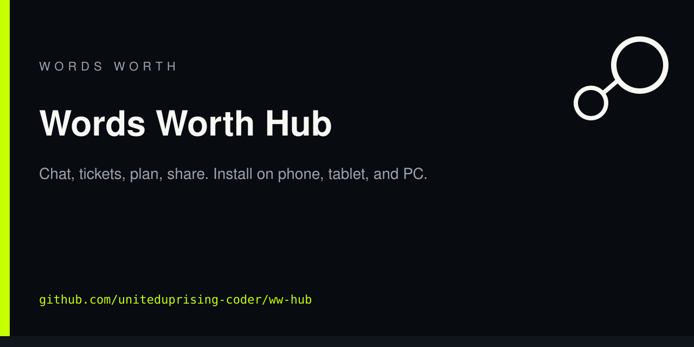

<!-- ww-card:start -->

  

  

  <a href="https://github.com/uniteduprising-coder/ww-hub"><b>Open repo</b></a>
  · <a href="https://uniteduprising-coder.github.io/ww-hub/">Hub</a>
  · <a href="https://github.com/uniteduprising-coder">All work</a>
  · <a href="https://uniteduprising-coder.github.io/ww-hub/">Live / home</a>

# Words Worth Hub

Chat, tickets, plan, share. Install on phone, tablet, and PC.

Scan the square or tap a link. Same card on every Wordsworth / United Uprising repo.

<!-- ww-card:end -->

## What this is

Chat, tickets, plan, share. Install on phone, tablet, and PC.

## Link bar

| | |
|---|---|
| Repo | https://github.com/uniteduprising-coder/ww-hub |
| Hub | https://uniteduprising-coder.github.io/ww-hub/ |
| Studio | https://github.com/uniteduprising-coder |

## House rules

- Local-first. No extra daemons.
- T4 KEEP set stays. Do not delete unique takeouts or Arctic.
- Romney is the free local agent (`effi.exe` + NOR), not a paid model.
